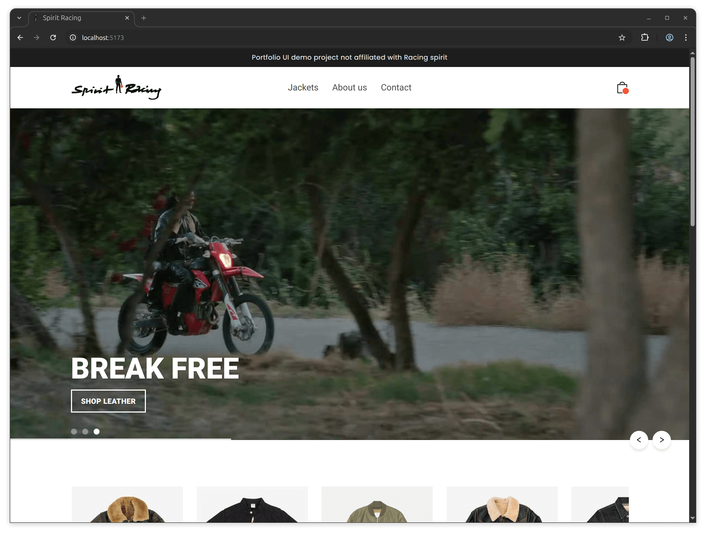
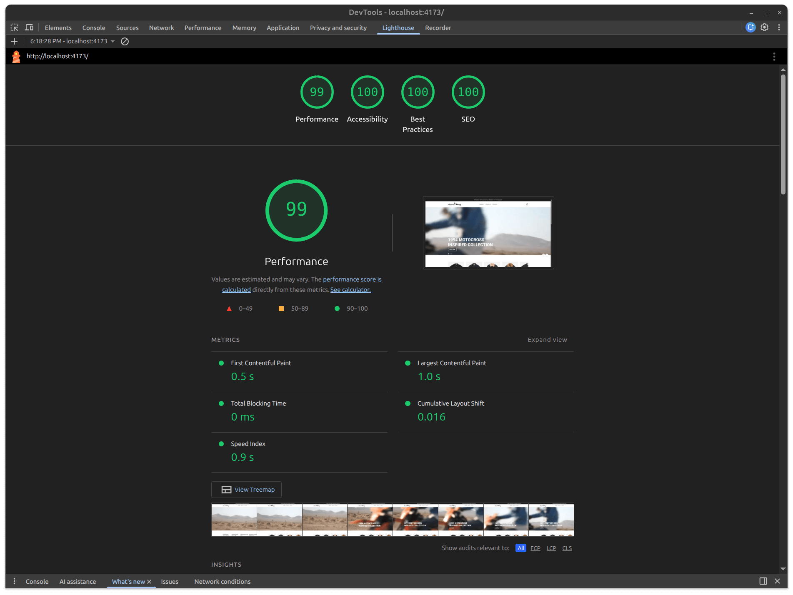
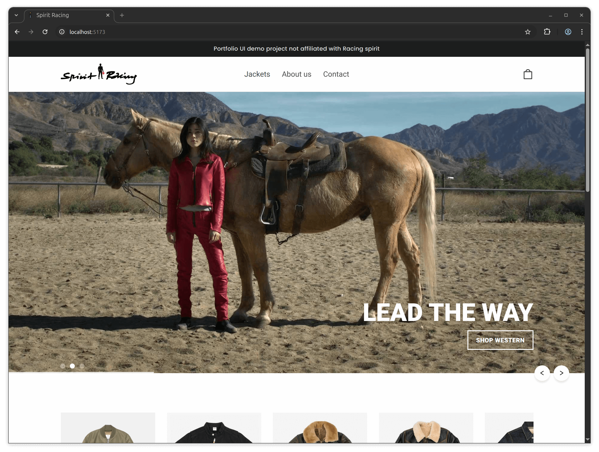
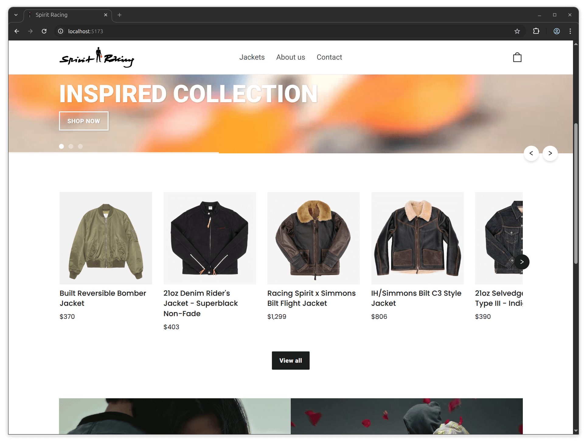
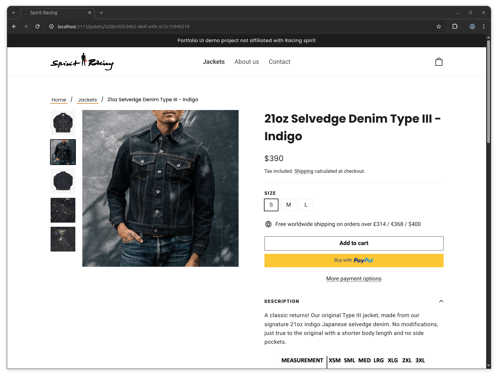
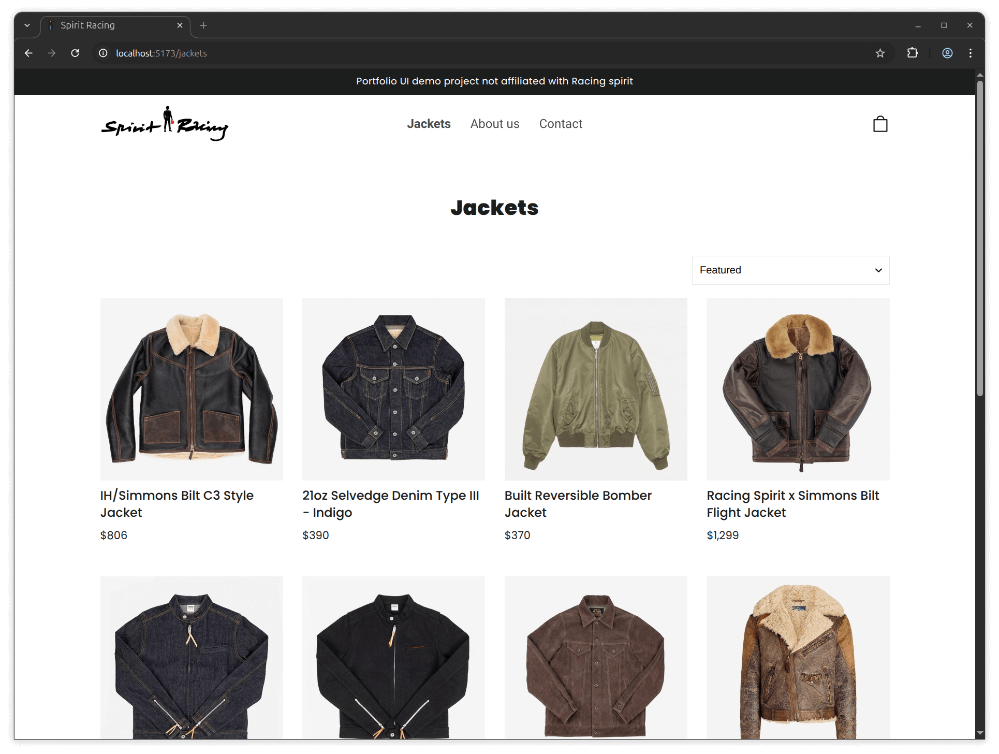
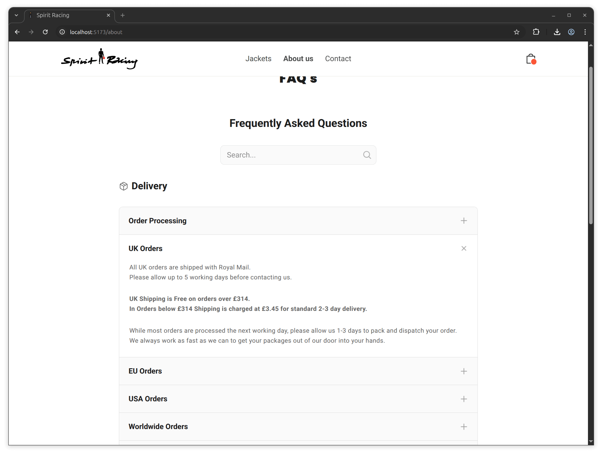
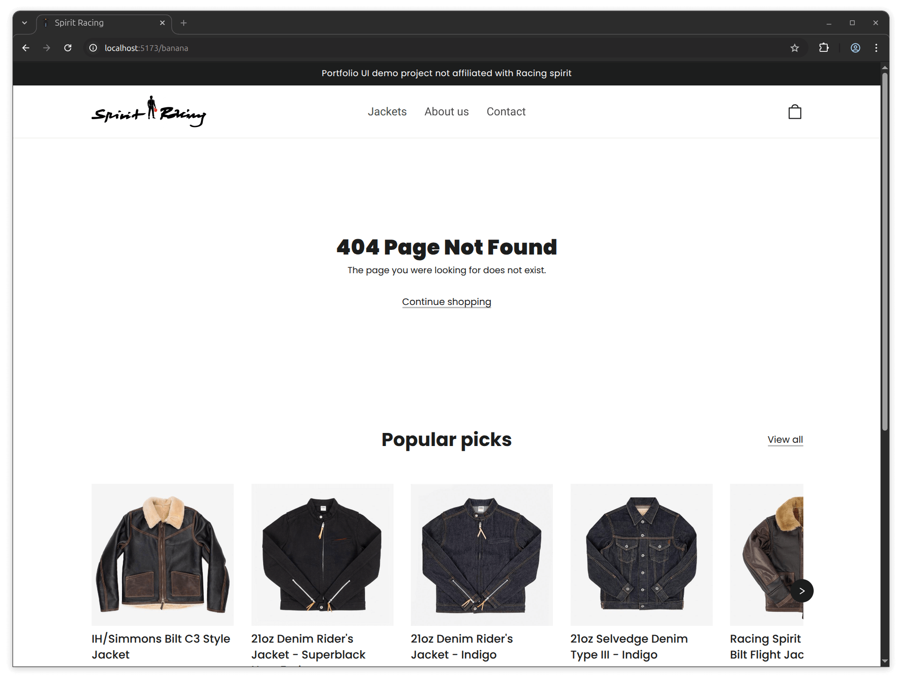

# 🐎 Spirit Racing – A Motorcycle Jacket E-Commerce SPA



## 📋 About

[Spirit Racing](https://racing-spirit.pages.dev/) is an e-commerce **single-page application (SPA)**, featuring a JSON mock back-end, developed from scratch using **HTML/CSS**, **JavaScript** , and **React**. Inspired by [DoomsdayCo](https://doomsdayco.com/) design and featuring product images from [Iron Heart](https://www.ironheart.co.uk/). The platform offers a diverse range of high-quality jackets designed for both safety and style. With its **responsive**, **user-friendly**, and **accessible** interface, Spirit Racing ensures a seamless shopping experience.

> Employing React best practices, I prioritized meticulous **component organization**, **structured file management**, and enforced **immutability**. My emphasis was especially on optimizing code for enhanced performance, readability and accessibility.

### 🌟 Acknowledgements

This project draws inspiration from several sources that helped shape its development:

- The design was inspired by [DoomsdayCo](https://doomsdayco.com/), and product images are sourced from [Iron Heart](https://www.ironheart.co.uk/).
- Several **YouTube tutorials**, **forums**, and online documentation, such as **W3Schools** and **MDN** helped shape the development process.

<br>

## 🚀 Features

- 🏗️  **Modular Architecture:** Built with a clean React-based structure, following best practices for component-based development.
- 📱 **Responsive, Dynamic Interface Across All Devices:** Fully responsive design using vanilla CSS and media queries to adapt seamlessly across desktops, tablets, mobiles, and more.
- 🌍 **Accessibility Focus:** Features keyboard-navigable elements, ARIA support for screen readers, and an inclusive design approach.
- ⚡ **Optimized Performance:** Optimized for speed with minimal dependencies, offering a fast user experience and near-perfect Google Lighthouse scores for performance, accessibility, best practices, and SEO.
- 🛒 **Functional Cart System:** Custom-built cart using localStorage and React Context API to manage user selections across pages.
- 🖼️ **Dynamic Product Display:** Product carousel, collection views, and detailed product previews using custom components.
- 🛰️ **Data Fetching with Hooks:** Custom hooks such as `useFetch` ensure efficient data management and smooth user interactions.
- 🚦 **Proper Routing Handling:** Fully integrated React Router for managing routes and page navigation. It ensures dynamic content loading and smooth transitions between views.
- 🏷️ **404 Page:** Custom-built NotFound page for handling invalid routes, providing a smooth and user-friendly experience even when users land on non-existent URLs.
- 🧩 **Reusable Components:** Key components such as the product accordion and contact form are designed to be reusable across multiple views.

### 📊 Audit and Security Scores

Below are the actual audit and security test results demonstrating the project's performance and integrity.



<br>

## 🧪 Local Development

The following project was fully designed and built by me, from layout to logic. You are welcome to use it as a base for your own project. Just a mention would be appreciated.

1. **Clone the Repository**  
First, clone the repository to your local machine:

    ```bash
    git clone https://github.com/angelvalentino/racing-spirit.git
    ```

1. **Install Dependencies**
Navigate into the project directory and install the necessary dependencies:

    ```bash
    cd racing-spirit
    npm install
    ```
1. **Run for Local Development**
To start the development server and run the app locally:

    ```bash
    npm run dev
    ```

1. **Prepare and Preview the Production Build**
To create an optimized build for production and preview it locally:

    ```bash
    npm run build
    npm run preview
    ```

<br>

## 🌱 Spirit Racing: Evolution, Features and Limitations

### Development Approach

- **Goal:** A fully functional, accessible e-commerce site that showcases high-quality motorcycle jackets with dynamic content loading.
- **Crafted with Care:** Every feature has been developed with best practices, ensuring a clean, modular, and scalable codebase.
- **Accessible Event Handling:** Extensive use of React Context API, `useState`, and `useEffect` for managing state and component lifecycle events to ensure smooth interactions as well as integrating proper WAI-ARIA support..

### Current Limitations

While the project follows modern development best practices, it currently uses a mock back-end via JSON server to simulate API calls. The shopping cart does not have authentication mechanisms in place for user data, and there is no checkout functionality. The project simulates the UI and is designed for demonstration and educational purposes, not for production use.

📌 Notwithstanding, there are no current plans to update this project, as it's considered to already fulfill its purpose in a clear, accessible, and responsive way.

### Accessibility (a11y) Overview

- **Inclusive Design:** The application was built with inclusivity in mind, ensuring the interface is intuitive and easy to navigate for all users, including those with disabilities.
- **Keyboard Navigation:** The entire site, including modals, carousels, and forms, supports full keyboard navigation.
- **ARIA Support:** ARIA attributes are applied judiciously to enhance accessibility without overcomplicating the markup, ensuring smooth interaction with screen readers and other assistive technologies.
- **Semantic HTML:** Semantic HTML elements are used throughout to improve both accessibility and SEO, enabling assistive technologies to accurately interpret the content structure.

### Architecture Overview

- **Modular Design:** The app follows a component-based structure, leveraging React’s strengths for clear separation of concerns.
- **Optimized Performance:**  Built with minimal dependencies, the app ensures fast load times and a smooth user experience, optimized with Webpack and Babel for efficient bundling.
- **Reusable Components:** Includes reusable components for easier maintenance and scalability.

<br>

## 🖼️ Additional Images















<br>

## 📬 Contact

Feel free to reach out for feedback, collaboration, or opportunities:

- **GitHub**: [angelvalentino](https://github.com/angelvalentino)  
- **Email**: angelvalentino294@gmail.com

While I deeply value collaboration and community feedback, this project serves as a personal showcase of my software development and engineering skills. For that reason, I personally implement all features and improvements.

That said, I welcome **issues**, **suggestions**, and **feedback** considering **pull requests for bugs or non-feature enhancements** on a case-by-case basis.